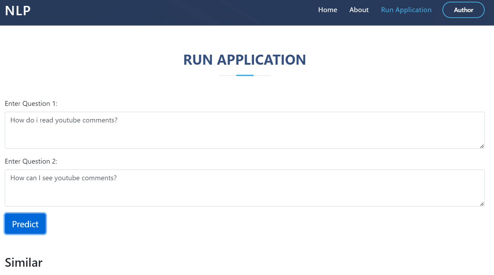
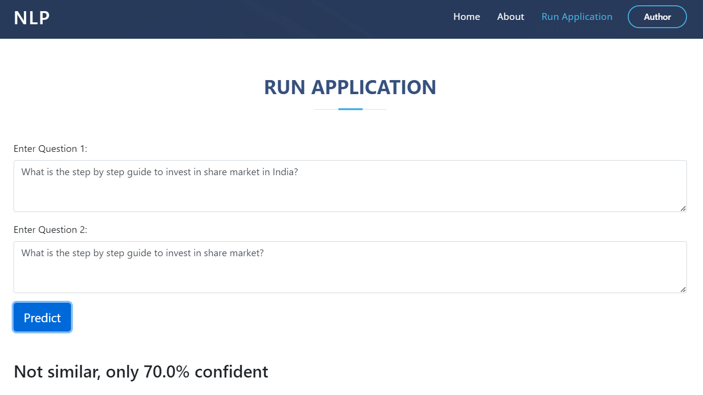
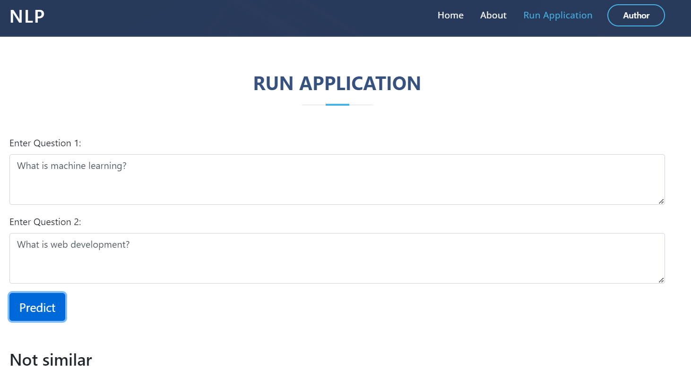

# Question Pair Similarity


Over 100 million people visit Quora every month, so it's no surprise that many people ask similarly worded questions. Multiple questions with the same intent can cause seekers to spend more time finding the best answer to their question, and make writers feel they need to answer multiple versions of the same question. Quora values canonical questions because they provide a better experience to active seekers and writers, and offer more value to both of these groups in the long term.

Credits: Kaggle

## Table of Contents
* [General Info](#general-information)
* [Constraints](#constraints)
* [Metrics](#metrics)
* [Data Overview](#data-overview)
* [Libraries](#libraries)
* [Screenshots](#screenshots)
* [Setup](#setup)
* [Usage](#usage)
* [Contact](#contact)
* [License](#license)

## General Information
Identify which questions asked on Quora are duplicates of the questions that have already been asked. This could be useful to instantly provide answers. We are tasked with predicting whether a pair of questions are duplicates or not.

## Constraints
- The cost of a mis-classification can be very high.
- No strict latency concerns.
- Interpretability is partially important.

## Metrics
- Log loss 
- Confusion Matrix

## Data Overview
Data has 6 columns and a total of 4,04,287 entries.
- id - Id
- qid1 - Id corresponding to question1
- qid2 - Id corresponding to question2
- question1 - Question 1
- question2 - Question 2
- is_duplicate - Determines whether a pair is duplicate or not

##  Libraries
- Application Framework - flask, wsgiref
- Data processing and ML - numpy, pandas, matplotlib, sklearn, xgboost, seaborn, spacy, nltk, contractions, fuzzywuzzy, distance, optuna
- General operations - os, pickle, re


## Screenshots





## Setup
Clone this repo using
```sh
git clone https://github.com/Anil-45/Question_Pair_Similarity.git
```

Install the required modules using
```sh
pip install -r requirements.txt
```

## Usage

Run the following command to start the application
```bash
python app.py
```

Access the [application](http://127.0.0.1:5000/)

For training yourself, download the [data](https://www.kaggle.com/c/quora-question-pairs) and place it in `data` folder

Find the optimal parameters by running `tune.py`
```bash
python tune.py
```
Train the model from optimal parameters
```bash
python train.py
```
For predictions, place the `test.csv` in `data` folder
```bash
python predict.py
``` 

## Contact
Created by [@Anil_Reddy](https://github.com/Anil-45/) 

## References
- https://www.kaggle.com/c/quora-question-pairs/discussion
- https://github.com/seatgeek/fuzzywuzzy#usage
- https://chairnerd.seatgeek.com/fuzzywuzzy-fuzzy-string-matching-in-python/
